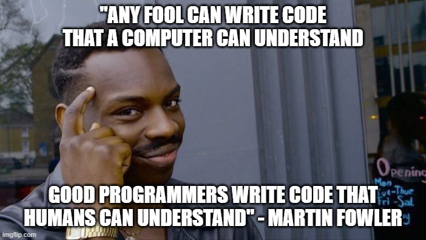
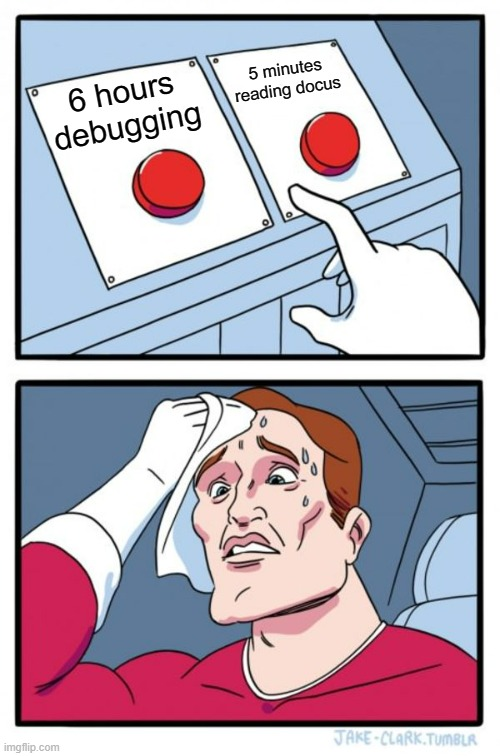

# Backend general guidelines

---

As backend team:

* We aim to design and implement **clean code solutions**.

* We develop maintainable, robust, scalable and reliable applications.

* We ensure **code quality** by **testing** and conducting **code reviews**.

* We seek to **collaborate** with other members of the team to create elegant code in
an **agile development environment**.

* We contribute to the **maturity** and **trust** of the team by providing **feedback** to other
team members and by applying the **[boy scout rule](#boy-scout-rule)**.

* We **work closely** with the **product owner** to **understand the end-user requirements**.

To do so, we write down some guidelines that could be useful.

## Boy scout rule

---

> We ensure **code quality** by **testing** and conducting **code reviews**.
> 
> We contribute to the **maturity** and **trust** of the team by providing **feedback** to other
team members and by applying the **[boy scout rule](#boy-scout-rule)**.

## Clean code

---

> We aim to design and implement **clean code solutions**.

Clean code is a series of principles that help us produce intuitive and easy-to-modify code.

In [this article](https://medium.com/@BrunoLM7/a-brief-summary-of-clean-code-c0c557739551) we find a summary on which we should base our code.

## SOLID principles

---

> We develop maintainable, robust, scalable and reliable applications.

SOLID consists in five principles that help us produce maintainable code, help us to avoid
rigid, fragile and coupled code. These principles are the following:

- Single Responsibility principle
> A class should have only one reason to change.

- Open/Closed principle
> Software entities (classes, modules, functions, etc) should be open for extension but 
> closed for modification.

- Liskov Substitution principle
> Subclasses should behave nicely when used in place of their base class.

- Interface Segregation principle
> A client should never be forced to implement an interface that it doesn't use or
> clients shouldn't be forced to depend on methods they don't use.

- Dependency Inversion principle
> High-level modules should not depend on low-level modules, both should depend on abstractions.
> Abstractions should not depend on details, details should depend on abstractions.

## Think before code

---

> We aim to design and implement **clean code solutions**.
> 
> We seek to **collaborate** with other members of the team to create elegant code in
an **agile development environment**.
> 
> We **work closely** with the **product owner** to **understand the end-user requirements**.

To ensure that the code **accomplishes the requirements** (whether are user or technical requirements), 
we must **plan and design before implement** any code. This way, we will be sure that 
our solution meet all the expected requirements. This is specially important in an **agile environment**.

