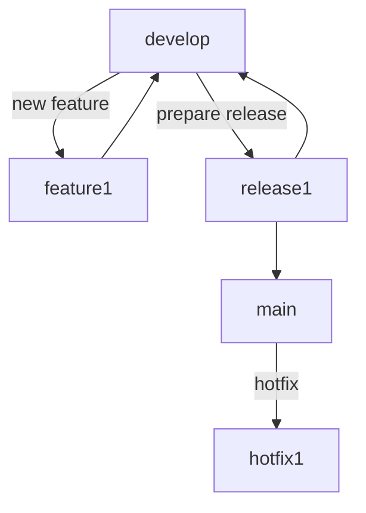
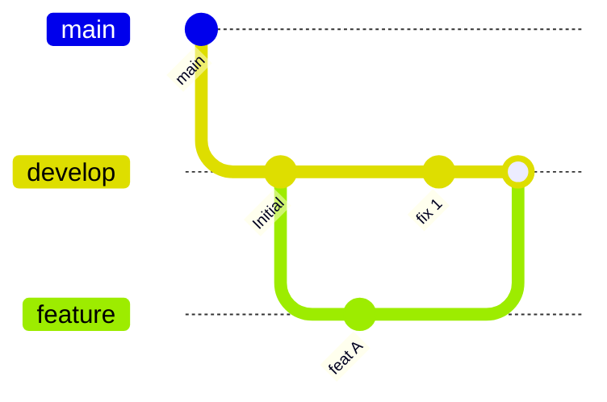

# Git general guidelines

As a development team:

* We aim to **collaborate smoothly** and **move fast without breaking things**.

* We use **clear branch names** and **well-written commits** to make our history easy to read and understand.

* We **enforce consistency** through naming conventions and commit rules.

* We integrate tools like **Commitlint** and **Conventional Commits** to **automate good practices**.

* We believe **Git history is for humans**, not just machines.

To do so, we write down some guidelines that could be useful.

---

## Branch naming convention

> We use **clear branch names** to keep things organized and easy to follow.

Naming your branch properly makes it easier for others (and your future self) to understand what you're working on — without opening Jira or reading your 42 commits.

Use this format:

```
<type>/<jira-id>-<short-description>
```

Examples:
```
feat/PROJ-123-login-endpoint
fix/PROJ-456-null-checks
chore/PROJ-789-update-ci
```

**Types:**
- `feat`: New feature
- `fix`: Bug fix
- `chore`: Configuration, CI/CD, etc.
- `refactor`, `docs`, `test`, etc. (same as commit types)

> This tiny habit brings huge clarity to PR reviews and Git logs.


---

## Conventional commits

> We write commits that tell a story — short, clear and consistent.

The [Conventional Commits](https://www.conventionalcommits.org/en/v1.0.0/) format helps automate changelogs, releases and Git history analysis.

Use this format:

```
<type>(optional-scope): short description
```

Examples:
```
feat(auth): add token refresh logic
fix(core): prevent crash when API returns null
docs: update README usage instructions
```

**Types we use:**
- `feat`, `fix`, `refactor`, `docs`, `chore`, `test`, `ci`, `perf`, `style`

💡 *Avoid "misc changes", "oops", or "try again" — your teammates deserve better.*


---

## Commitlint & IntelliJ plugin

> We integrate **tools** to **make good practices automatic**.

### ✅ IntelliJ – Conventional Commit Plugin

- Adds a small UI when committing
- Shows available commit types and scopes
- Prevents you from writing “useless” messages like `“changes”`

📍To install:
```
Settings → Plugins → Marketplace → Search "Conventional Commit"
```

### 🔍 Commitlint + Husky

Let’s enforce commit message rules automatically.

**Steps:**

1. Install dev dependencies:
```bash
npm install --save-dev husky @commitlint/{config-conventional,cli}
```

2. Add config file:
```bash
echo "module.exports = { extends: ['@commitlint/config-conventional'] };" > commitlint.config.js
```

3. Enable hooks:
```bash
npx husky install
```

4. Add hook to validate commits:
```bash
npx husky add .husky/commit-msg 'npx --no -- commitlint --edit "$1"'
```

> ⚠️ Git hooks are local, not pushed to GitHub. Make sure teammates install them!

---

## Why this matters

> We believe **Git history is for humans** — and should be readable, traceable and reliable.

Clean Git practices bring clarity in PR reviews, help you squash bugs faster, and make onboarding new teammates a breeze.


---

## Summary

| 🔧 Practice         | 💡 Example                             |
|---------------------|----------------------------------------|
| **Branch naming**   | `feat/PROJ-101-login-form`             |
| **Commit format**   | `fix(core): avoid crash when input is empty` |
| **Enforced with**   | Commitlint + Conventional Commit plugin |
| **Bonus**           | Easy changelogs, faster reviews, cleaner diffs |

---

## Final thought

Git is our timeline. Let’s make it clean, clear, and human-friendly.  
Future-you (and your team) will thank you. 🙌


---

## 🧬 Git Workflow: GitFlow + Clean History

> We follow a **branching strategy** that keeps our repo organized and easy to navigate.

We loosely follow **GitFlow**, with some simplifications:

- `main`: stable code, always ready to deploy
- `develop`: ongoing development
- `feature/*`: feature branches, merge into `develop`
- `hotfix/*`: quick fixes, go directly to `main` (and then `develop`)
- `release/*`: optional, used when preparing a release

<details>
<summary>🔍 View diagram</summary>



</details>

---

## 🧪 Merge vs Rebase vs Squash

> We **prefer `rebase` over `merge`** to keep a linear and clean history.

### 🧷 Merge

Keeps all the individual commits + adds a merge commit.  
Good for preserving full history, but makes it **messy** for short-lived branches.

<details>
<summary>🔍 View diagram</summary>



</details>

*Result: one extra merge commit, multiple parallel lines.*

---

### 🔁 Rebase (we prefer this)

Moves your commits on top of the latest from the target branch.  
Keeps history **linear**, cleaner for `git log`.

<details>
<summary>🔍 View diagram</summary>


</details>

*Result: linear history, easier to follow.*

> ⚠️ Rebase only works well when your feature branch is **local and not shared yet**.

---

### ✂️ Squash

Squash combines all your commits into a **single commit** when merging a PR.  
Perfect for keeping the history tidy for small features or WIP.

<details>
<summary>🔍 View diagram</summary>


</details>

*Result: One meaningful commit in `main`.*

---

## ✅ Our Recommendation

| Situation | Recommended Action |
|----------|--------------------|
| Ongoing work in feature branch | `git pull --rebase` to stay updated |
| Finishing a feature | Rebase before opening PR |
| Merging PR | Prefer **Squash & merge** |
| Fixing conflicts in PR | Use `git rebase develop` |

> Rebase = clean commit history  
> Merge = messy but safe  
> Squash = best of both if history isn't critical

